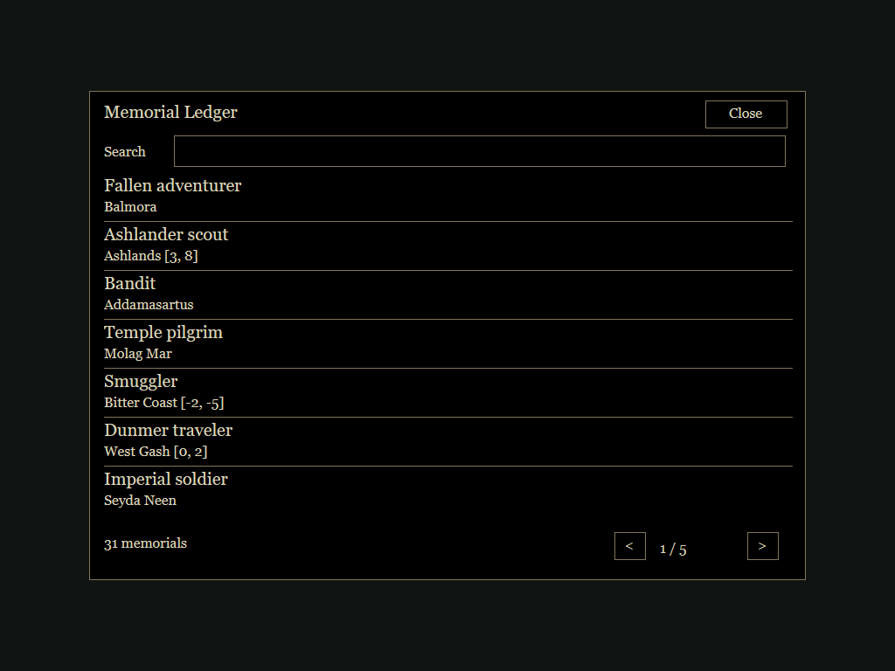

# Memorial Ledger

A personal record of those found dead during your travels in **OpenMW**.
Remember their names, places of death, and your own memorial notes without
interacting with their bodies.

**Version 0.2.5 | Beta | Default key: M**

This mod is observational only. It never removes corpses, reads inventories,
adds corpse interaction prompts, or changes game records. No custom textures,
models, or animations are required.

## Compatibility

Developed against OpenMW 0.52 development APIs. Requires Menu and Player Lua
contexts, MWUI, UI, and input-binding support. Classic Morrowind/MWSE is not
supported. Native engine acceptance testing is still outstanding: try a
disposable save first. Automated tests do not prove in-game compatibility.

## Install

Use the import-ready ZIP attached to a GitHub release when one is available.
The archive contains `MemorialLedger.omwscripts`, `scripts`, and `l10n` at its
root. Install it as an OpenMW data directory and enable
`MemorialLedger.omwscripts` in your content list.

From a source checkout, use the **Memorial Ledger** subdirectory as the data
directory, not the repository root. See the [installation guide](Memorial%20Ledger/README.md).

Fully restart OpenMW after updating. This repository does not edit your game
configuration, installed mods, or saves.

## In Game

- Press **M** to open or close the ledger. Existing custom bindings are preserved.
- Search by partial NPC name and select an entry to read it or write a **Memorial Note**.
- Notes save when you leave the entry using Back or Close.
- Change **Ledger Key** under Options > Scripts > Memorial Ledger > Controls.
- **Open** under Ledger Actions opens the ledger after Options closes.

Dead NPCs in active cells are discovered when they become active and every five
simulation seconds. Creatures and players are excluded. Entries and notes belong
to the current save. **Found on** is discovery time, not a claimed death time.
**Place of Death** uses the body's location at discovery; a moved body's original
death location cannot be recovered.



The image above is generated from the actual Lua layout with mocked OpenMW APIs.
It is **not an in-game screenshot**; native fonts and spacing may differ.

## Player Documentation

- [Installation and gameplay guide](Memorial%20Ledger/README.md)
- [Changelog](CHANGELOG.md)
- [Documentation page](reports/memorial-ledger.html)

## Maintainer Notes

The following sections are for contributors and release maintainers, not players.
You do not need development tools, GitHub Actions, or a Nexus API key to use the mod.

### Development

Requires Python 3.12 and the pinned development dependency:

```sh
python -m pip install -r requirements-dev.txt
python tests/run_tests.py
python -m unittest discover -s tests -p test_release.py -v
python tools/export_preview.py
python tools/package_mod.py
```

Packaging writes `dist/MemorialLedger-0.2.5.zip` and verifies its manifest,
script paths, and ZIP integrity. GitHub Actions runs the Lua 5.1 tests and
packaging on Linux and Windows; it does not run the game.

See the [contributor and maintainer guide](CONTRIBUTING.md) and
[in-game acceptance checklist for testers](Memorial%20Ledger/ACCEPTANCE.md).

### Nexus Publishing

A version tag push, such as `v0.2.6`, automatically tests, packages, and uploads
a new version of the existing Nexus file, and updates the Nexus mod's version.
The tag must match `VERSION`. Ordinary branch pushes do not publish. A manual
fallback defaults to a dry run. See the [maintainer Nexus publishing guide](NEXUS-PUBLISHING.md)
for the initial file upload, environment secret, and file ID requirements.

## License

A license has not been selected yet. No open-source license grant is currently
provided. Choose a license before inviting reuse or redistribution.
