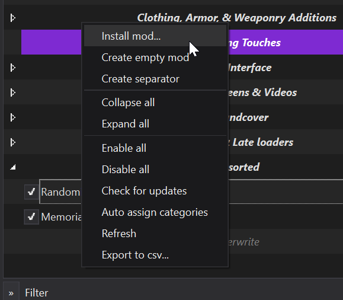
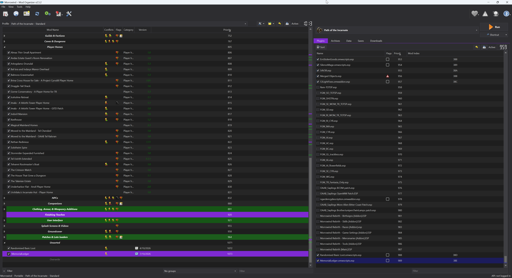
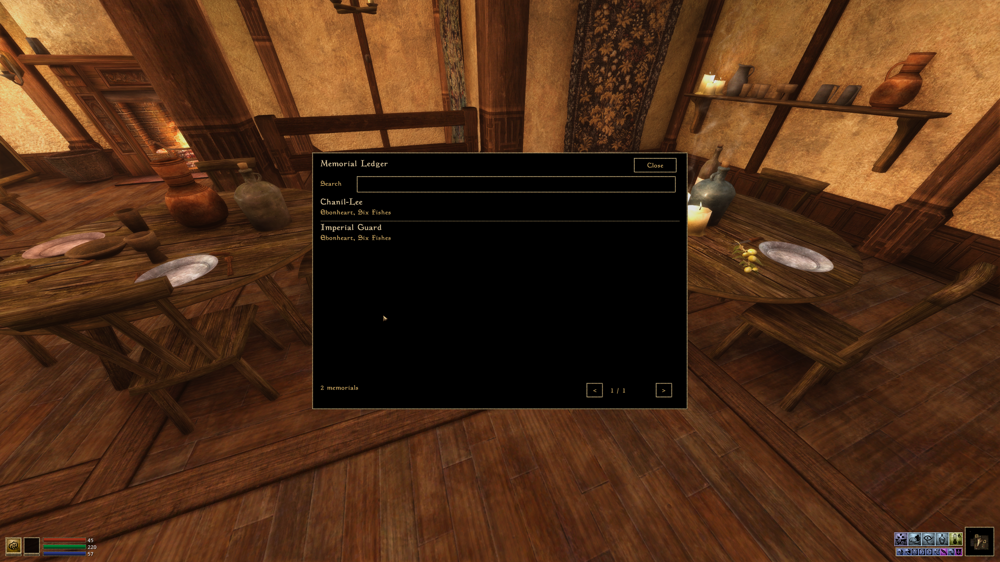
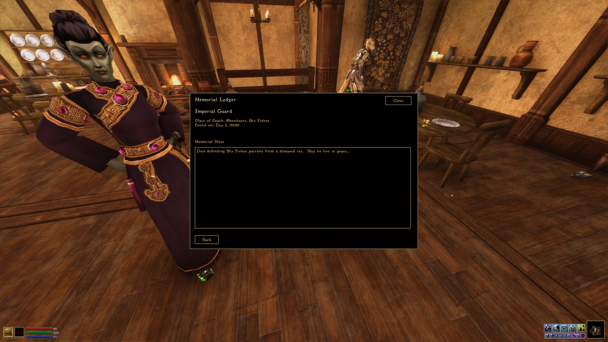
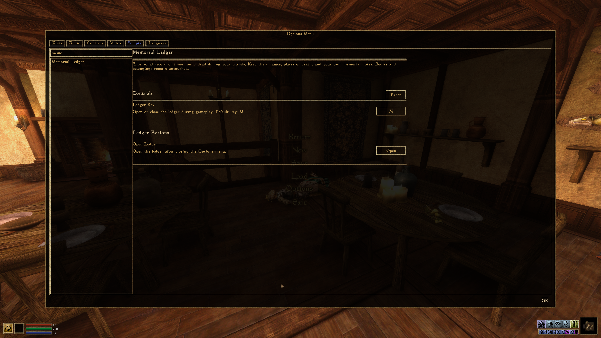

# Memorial Ledger

A personal record of those found dead during your travels in **OpenMW**.
Remember their names, places of death, and your own memorial notes without
interacting with their bodies.

**Version 0.2.6 | Beta | Default key: M**

**Open the ledger:** press **M** during gameplay.
**Settings:** **Options > Scripts > Memorial Ledger**.

This mod is observational only. It never removes corpses, reads inventories,
adds corpse interaction prompts, or changes game records. No custom textures,
models, or animations are required.

## Compatibility

Developed against OpenMW 0.52 development APIs. Requires Menu and Player Lua
contexts, MWUI, UI, and input-binding support. Classic Morrowind/MWSE is not
supported, even when managed through MO2. In-game screenshots are shown below;
broader compatibility and save/load testing remain ongoing. Try a disposable
save first. Automated tests do not prove compatibility with every setup.

## Install

Use the import-ready ZIP attached to a GitHub release when one is available.
The archive contains `MemorialLedger.omwscripts`, `scripts`, and `l10n` at its
root. Do not install GitHub's automatically generated source ZIP as a mod.

### OpenMW: Manual Installation

1. Close OpenMW and extract the mod ZIP to its own directory, for example
   `D:/Games/OpenMW/Mods/MemorialLedger`.
2. Add that directory to your active `openmw.cfg` using the lines below. Keep
   existing data paths and content entries; do not replace the whole configuration.
3. Ensure `MemorialLedger.omwscripts` is enabled in OpenMW's content list.
4. Restart OpenMW, load a game, and press **M**. Check **Options > Scripts >
   Memorial Ledger** for the settings page.

```ini
data="D:/Games/OpenMW/Mods/MemorialLedger"
content=MemorialLedger.omwscripts
```

Adjust the example path. Use the configuration for the profile you actually
launch; on a standard Windows installation it is normally under
`Documents/My Games/OpenMW`. See [OpenMW's Lua mod installation guidance](https://openmw.readthedocs.io/en/latest/reference/modding/extended.html#lua-scripting)
and [configuration paths](https://openmw.readthedocs.io/en/latest/reference/modding/paths.html).

### Morrowind In Mod Organizer 2: OpenMW Required

1. Right-click in MO2's left-hand mod list and choose **Install mod...**
   (the archive-install toolbar button works too).
2. In **Choose Mod**, select the latest `MemorialLedger-<version>.zip` and click
   **Open**, then finish installation. You do not need to extract the ZIP first.
3. Tick **MemorialLedger** in the left-hand mod list. Its name can differ if you
   rename the mod during installation.
4. In the right-hand **Plugins** tab, tick **MemorialLedger.omwscripts.esp**,
   generated automatically by your OpenMW integration's dummy-ESP support. It is a
   placeholder: the integration enables the real `MemorialLedger.omwscripts` file
   when exporting or launching OpenMW. You do not need to create an ESP yourself.
5. Run your profile's configured **OpenMW** executable, not **Morrowind.exe**.
   Load a game and press **M**.

[](docs/screenshots/mo2-install-menu.png)

[](docs/screenshots/mo2-enabled.png)

Both checkboxes must be enabled. The pictured modlist, other mods, priority
numbers, and executable label are examples, not requirements for Memorial Ledger.

Follow the [OpenMW Player setup guide](https://github.com/Kezyma/ModOrganizer-Plugins/blob/main/docs/openmwplayer.md)
for integration setup. If no placeholder appears, check **Dummy ESP** in
OpenMW Player's Options. This generation is supplied by the integration, not
plain MO2 or an ESP bundled in the mod ZIP. If using an Export-to-OpenMW plugin instead, export after
enabling the mod and verify your active configuration includes both its `data=`
path and `content=MemorialLedger.omwscripts`. Recheck after later exports.

From a source checkout, use the **Memorial Ledger** subdirectory as the data
directory, not the repository root. See the [installation guide](Memorial%20Ledger/README.md).

Fully restart OpenMW after updating. This repository does not edit your game
configuration, installed mods, or saves.

### If The Ledger Is Missing

Check the data directory contains the manifest, `scripts`, and `l10n`, and that
the active profile enables the `.omwscripts` file. If **Memorial Ledger** is
missing from **Options > Scripts**, check `openmw.log` for script-loading errors.
If the settings page appears but M does nothing, check **Controls > Ledger Key**
for a preserved custom binding or conflict; **Ledger Actions > Open** is an alternative.

## In Game

- Press **M** to open or close the ledger. Existing custom bindings are preserved.
- Search by partial NPC name and select an entry to read it or write a **Memorial Note**.
- Notes save when you leave the entry using Back or Close.
- Change **Ledger Key** under Options > Scripts > Memorial Ledger > Controls.
- **Open** under Ledger Actions opens the ledger after Options closes.

Dead NPCs in active cells are discovered when they become active and every five
simulation seconds. Creatures and players are excluded. Entries and notes belong
to the current save. **Found on** is discovery time, not a claimed death time.
**Place of Death** uses the body's location at discovery; a moved body's original
death location cannot be recovered.
Places are shown by name or region, without technical grid coordinates.

## In-Game Screenshots

Screenshots supplied by the author, showing the mod running in OpenMW. Other
mods supply the surrounding world visuals. Select an image for the original
full-resolution screenshot.

### Searchable Ledger

[](docs/screenshots/ledger-list.png)

### Personal Memorial Notes

[](docs/screenshots/memorial-note.png)

Notes save when you leave the entry with **Back** or **Close**.

### Settings And Key Binding

[](docs/screenshots/settings.png)

Find this page under **Options > Scripts > Memorial Ledger**. Change the key under
**Controls > Ledger Key**, or use **Reset** to restore **M**.

## Player Documentation

- [Installation and gameplay guide](Memorial%20Ledger/README.md)
- [Changelog](CHANGELOG.md)
- [Documentation page](reports/memorial-ledger.html)

## Maintainer Notes

The following sections are for contributors and release maintainers, not players.
You do not need development tools, GitHub Actions, or a Nexus API key to use the mod.

### Development

Requires Python 3.12 and the pinned development dependency:

```sh
python -m pip install -r requirements-dev.txt
python tests/run_tests.py
python -m unittest discover -s tests -p test_release.py -v
python tools/export_preview.py
python tools/package_mod.py
```

Packaging writes `dist/MemorialLedger-0.2.6.zip` and verifies its manifest,
script paths, and ZIP integrity. GitHub Actions runs the Lua 5.1 tests and
packaging on Linux and Windows; it does not run the game.

See the [contributor and maintainer guide](CONTRIBUTING.md) and
[in-game acceptance checklist for testers](Memorial%20Ledger/ACCEPTANCE.md).

### Nexus Publishing

A version tag push, such as `v0.2.6`, automatically tests, packages, and uploads
a new version of the existing Nexus file, and updates the Nexus mod's version.
The tag must match `VERSION`. Ordinary branch pushes do not publish. A manual
fallback defaults to a dry run. See the [maintainer Nexus publishing guide](NEXUS-PUBLISHING.md)
for the initial file upload, environment secret, and file ID requirements.

## License

A license has not been selected yet. No open-source license grant is currently
provided. Choose a license before inviting reuse or redistribution.
